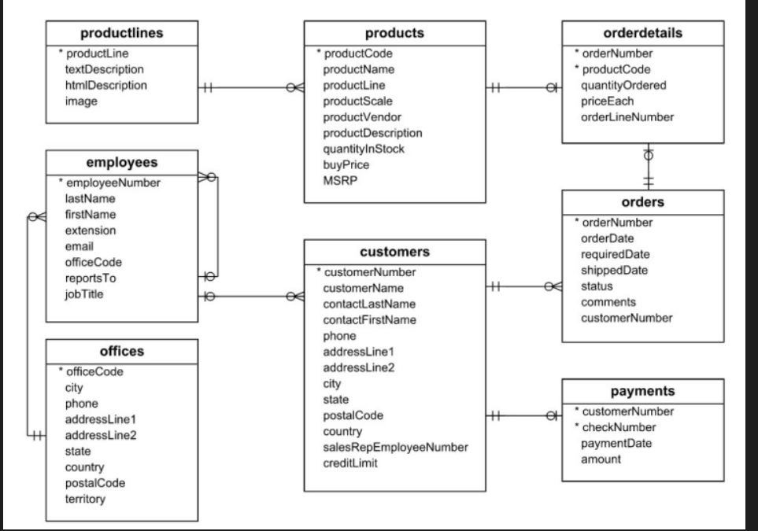
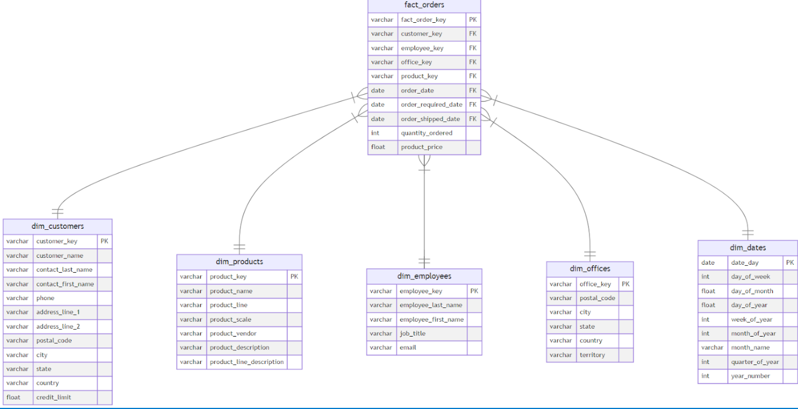

# 🛒 Retail Data Warehouse & Star Schema Transformation (dbt & PostgreSQL)

An end-to-end data engineering project that implements a modern analytics engineering workflow. The project extracts retail data from a relational transactional source schema, transforms it using **dbt (data build tool)** running inside a **Docker** environment, and builds a dimensional **Star Schema** optimized for analytical reporting.

---

## 🏗️ Architecture & Pipeline Overview

1. **Source Layer (Staging):** A Python script (`populate_db.py`) generates and populates a normalized relational schema (`staging_schema`) in a PostgreSQL database representing retail operations (Customers, Products, Orders, Employees, Offices, etc.).
2. **Transformation Layer (dbt):** dbt connects to the PostgreSQL database to model, clean, and transform the raw tables into analytical dimensions and facts.
3. **Serving Layer (Star Schema):** The final output is structured into a clean Star Schema (`star_schema`) inside PostgreSQL, ready for BI tools and dashboards.

---

## 📊 Database Schemas

### 1. Source Relational Schema (Transactional DB)
The operational database captures raw transactions and entity relationships:


### 2. Analytical Star Schema (dbt Marts)
The transformed dimensional model optimized for fast analytical queries:


---

## 🛠️ Tech Stack
* **Database:** PostgreSQL (hosted in Docker)
* **Transformation & Modeling:** dbt Core (running in a dedicated Python Docker container)
* **Data Generation:** Python (`psycopg2`, `Faker`)
* **Environment Control:** Docker & Docker Compose
* **Version Control:** Git & GitHub

---

## 🚀 Getting Started

1. **Clone the repository:**
   ```bash
   git clone [https://github.com/DataMan/dbt_to_star_schema.git](https://github.com/YOUR_USERNAME/dbt_to_star_schema.git)
   cd dbt_to_star_schema